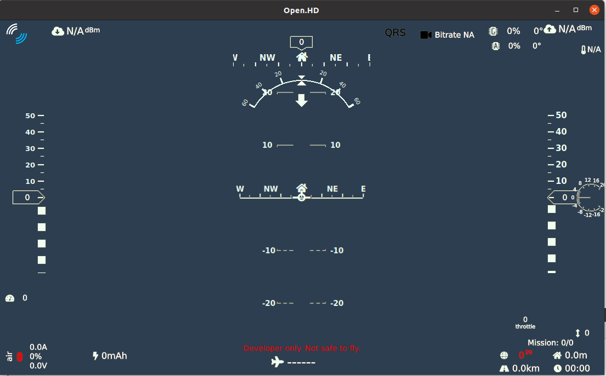

# QOpenHD

QOpenHD is the default OpenHD companion app that runs on the OHD Ground station or any other "external" devices connected to the ground station.

It is responsible for displaying the (main) video stream to the user, composed with the OSD and changing OpenHD settings.

As the name suspects, it is based on QT (5.15.X) and will not run on older Versions.

# Developer Design Overview (incomplete)
1) QOpenHD is not OpenHD (main). It can talk to a running OpenHD main instance (ground and/or air) via Mavlink and rceives the (primary / secondary / ++) video streams. 
2) While QOpenHD is the default companion app, OpenHD MUST NOT assume there is a QOpenHD instance somewhere that initiates voodo settings / setup processes
( This is in contrast to OpenHD /QOpenHD releases before the "evo" series.) As a result of this limitation, Both OpenHD and QOpenHD can be developed independently from each other, and debugging becomes a lot easier.

# Compiling:
We have a CI setup that checks compilation on ubuntu. You can look at the steps it performs to build and run QOpenHD.
Other platforms than Linux are not supported right now.

# Building QOpenHD Locally in QT (GSTREAMER MIGHT NOT BE REQUIRED as things progress)
#### Mac

1. Install Xcode from the Mac App Store.

2. Install Qt using the [Qt online installer](https://www.qt.io/download-qt-installer)

3. Have the Qt Installer download Qt 5.15.0+ for Mac, and Qt Creator

4. Clone the source code:

    git clone --recurse-submodules https://github.com/OpenHD/QOpenHD.git

If you aren't using git from the command line but using a GUI git client instead, make sure
you update the submodules or QOpenHD will not build properly.
    

Once you have those steps done you can open `QOpenHD.pro` with Qt Creator, build and run it.

#### iOS

1. Install Xcode from the Mac App Store.

2. Install Qt using the [Qt online installer](https://www.qt.io/download-qt-installer)

3. Have the Qt Installer download Qt 5.15.0+ for iOS, and Qt Creator

4. You will need an Apple developer membership to install directly to an iOS device

5. Clone the source code:

    git clone --recurse-submodules https://github.com/OpenHD/QOpenHD.git

If you aren't using git from the command line but using a GUI git client instead, make sure
you update the submodules or QOpenHD will not build properly.

Once you have those steps done you can open `QOpenHD.pro` with Qt Creator, build and run it.

#### Windows

1. Install Visual Studio 2019 (free)

2. Install Qt using the [Qt online installer](https://www.qt.io/download-qt-installer)

3. Have the Qt Installer download Qt 5.15.0+ and Qt Creator

4. Download the [GStreamer development kit](https://gstreamer.freedesktop.org/download/) for Windows, both the Runtime and Development packages. You *must use* the 32-bit MinGW packages, NOT the one labeled MSVC, and it should be version 1.14.4. (QT will look for gstreamer in c:/gstreamer/1.0/x86 )

5. Clone the source code:

    git clone --recurse-submodules https://github.com/OpenHD/QOpenHD.git

If you aren't using git from the command line but using a GUI git client instead, make sure
you update the submodules or QOpenHD will not build properly.

Once you have those steps done you can open `QOpenHD.pro` with Qt Creator, build and run it.

#### Linux

1. Install Qt using the [Qt online installer](https://www.qt.io/download-qt-installer)

2. Have it download Qt 5.15.0+ for Linux 

3. Install GStreamer development packages from the package manager. On Ubuntu this would be `apt install gstreamer1.0-gl libgstreamer1.0-dev libgstreamer-plugins-good1.0-dev gstreamer1.0-plugins-good libgstreamer-plugins-base1.0-dev gstreamer1.0-plugins-base libgstreamer-plugins-bad1.0-dev gstreamer1.0-plugins-bad gstreamer1.0-plugins-ugly gstreamer1.0-qt`. Those should pull in any others that are needed as well.

4. Clone the source code:

    git clone --recurse-submodules https://github.com/OpenHD/QOpenHD.git

If you aren't using git from the command line but using a GUI git client instead, make sure
you update the submodules or QOpenHD will not build properly.

Once you have those steps done you can open `QOpenHD.pro` with Qt Creator, build and run it.

#### Android

1. Install [Android Studio](https://developer.android.com/studio)

2. Use Android Studio to install Android SDK level 28, along with NDK r18b and the associated build toolchain.

3. Install Qt using the [Qt online installer](https://www.qt.io/download-qt-installer)

4. Have the Qt Installer download Qt 5.15.0+ *for Android*, not for the OS you're building on.

5. Clone the source code:

    git clone --recurse-submodules https://github.com/OpenHD/QOpenHD.git

If you aren't using git from the command line but using a GUI git client instead, make sure
you update the submodules or QOpenHD will not build properly.

You can then open `QOpenHD.pro` using Qt Creator and set up the Android kit (left side, click the Projects tab), build and run the app on your device.

# Building MAVSDK (REQUIRED)
QOpenHD relies on MAVSDK library. After recursively cloning qopenhd you have to build and install it once:

`./build_install_mavsdk_static.sh`

After that, you can build QOpenHD by either opening it in QT Creator (recommended) or building it with the following commands:

`mkdir build`
`cd build`
`qmake ..`

# Contributing

**Thanks to all the people who already contributed!**

