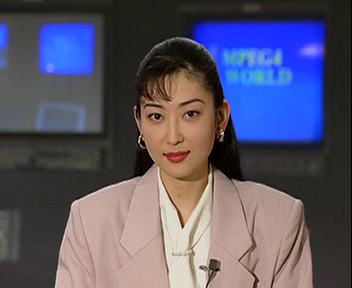

# Small .265 Video Corpus

We provide a small Annex B video corpus to test the parser. It includes
videos encoded with 3 different FOSS software encoders:

* [x265](http://hg.videolan.org/x265)
* [kvazaar](https://github.com/ultravideo/kvazaar)
* [turing](https://github.com/bbc/turingcodec.git)

In all cases, the experiments forced a fixed QP value. Parameters used were:

x265:
```
$ ffmpeg -i ${INFILE} -c:v libx265 -x265-params qp=15 outfile.265
```

Kvazaar:
```
$ ffmpeg -i ${INFILE} -c:v libkvazaar -kvazaar-params qp=15 outfile.265
```

Turing:
```
$ turing encode ${INFILE}.yuv --frame-rate 30 --input-res ${RESYUV} --frames ${FRAMESYUV} --qp 15 -o outfile.265
```

Some sample frames:




Videos:

* [akiyo.x265.qp_15.265](akiyo.x265.qp_15.265)
* [akiyo.x265.qp_30.265](akiyo.x265.qp_30.265)
* [akiyo.x265.qp_50.265](akiyo.x265.qp_50.265)
* [akiyo.kvazaar.qp_15.265](akiyo.kvazaar.qp_15.265)
* [akiyo.kvazaar.qp_30.265](akiyo.kvazaar.qp_30.265)
* [akiyo.kvazaar.qp_50.265](akiyo.kvazaar.qp_50.265)
* [akiyo.turing.qp_15.265](akiyo.turing.qp_15.265)
* [akiyo.turing.qp_30.265](akiyo.turing.qp_30.265)
* [akiyo.turing.qp_50.265](akiyo.turing.qp_50.265)

